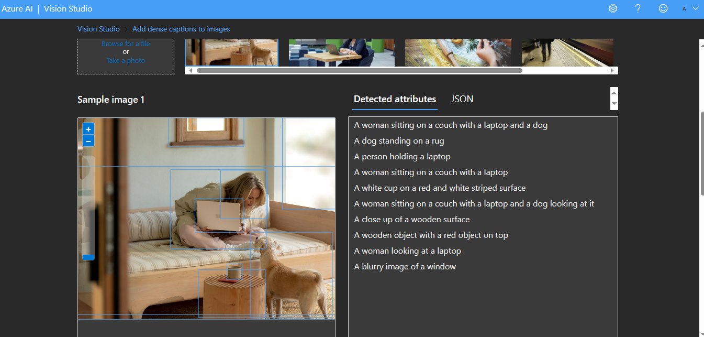

# Projeto DIO- Reconhecimento Facial e transformação de imagens em Dados no Azure ML

Passo a passo do projeto Reconhecimento Facial e Transformação ded imagens em Dados no Azure ML da DIO.

Links importantes:

[Detectar rostos no Vision Studio](https://microsoftlearning.github.io/mslearn-ai-fundamentals/Instructions/Labs/02-content-safety.html(https://microsoftlearning.github.io/mslearn-ai-fundamentals/Instructions/Labs/04-face.html))

[Ler texto no Vision Studio](https://microsoftlearning.github.io/mslearn-ai-fundamentals/Instructions/Labs/01-machine-learning.html(https://microsoftlearning.github.io/mslearn-ai-fundamentals/Instructions/Labs/05-ocr.html))

[Analisar imagens no Vision Studio](https://microsoftlearning.github.io/mslearn-ai-fundamentals/Instructions/Labs/01-machine-learning.html(https://microsoftlearning.github.io/mslearn-ai-fundamentals/Instructions/Labs/05-ocr.html)(https://microsoftlearning.github.io/mslearn-ai-fundamentals/Instructions/Labs/03-image-analysis.html))

Seguindo o passo a passo da documentação:

## Teste 1: Criando recurso e detectando rosto

Abri o portal Azure  e cliquei em "Create a resourse"

Em seguida em "categorias" cliquei na opção "IA + Machine Learning"

Pesquisei por "Azure AI services" e cliquei em create, seguindo a documentação.

Ao criar abri o Vision Studio ([azure.com](https://portal.vision.cognitive.azure.com/gallery/featured))

Alterei o theme para dark e cliquei em "View all resources" e selecionei o recurso criado "LabRF-TI"  (escolhi esse nome em referência ao nome do laboratório do curso "Reconhecimento Facial e transformação de imagens em Dados no Azure ML") e selecione como "default" e cliquei no x.

Ao clicar no "x" voltei para a página inicial e cliquei em "face"

Cliquei em "Detect faces in na image" e selecionei o "Try it out"

Selecionei uma imagem e o rosto da pessoa foi detectado em seguida, com o atributo e o código em JSON

[Clique aqui para ver o código](output/DetectandoRosto.json)

## Teste 2: Análise de documentos
Para fazer análise de dados, voltei a página inicial e cliquei em "Optical character recognition" para fazer análise de caracteres.

Abrindo "Extract text from images"

A opção "Try it out" já estava marcada, então prossegui e selecionei uma imagem e atributo e o código em JSON foi detectado em seguida

[Clique aqui para ver o código](output/AnaliseDeDocumentos.json)

Logo abaixo apareceu próximas etapas

## Teste 3 - Análise de imagem
Voltando a página inicial, novamente, cliquei em image analysis

E escolhi a opção "Add dense captions to images"

Selecionando uma imagem, ele traz toda a descrição em atributos e o código JSON.
A descrição serve também como acessibilidade.

[Clique aqui para ver o código](output/AnaliseDeImagem.json)

Logo abaixo apareceu próximas etapas

